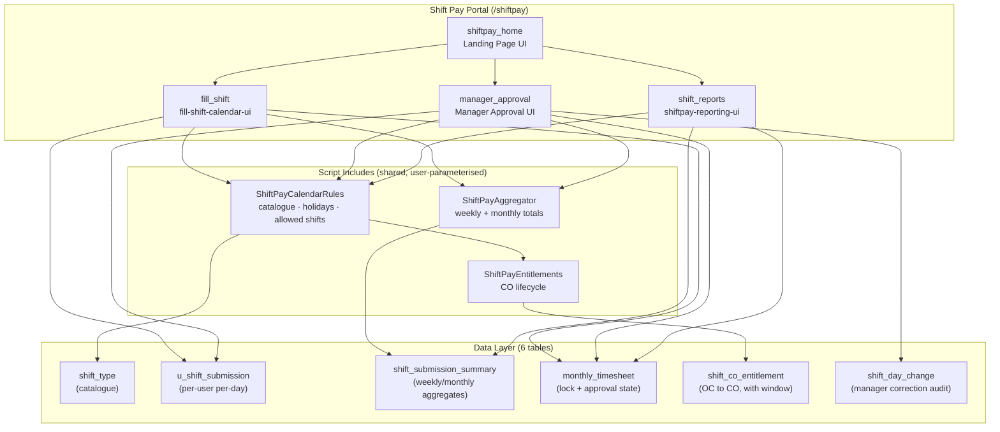

# 🕐 Shift Pay Management

A ServiceNow scoped application for tracking shift work, managing compensatory off (CO) entitlements, and computing pay. Employees log daily shifts through an interactive calendar portal; managers approve, reject and correct the team's monthly timesheets; a reporting page and a Power BI model read the same data back.

---

## 📋 Table of Contents

- [Overview](#overview)
- [Repository layout](#repository-layout)
- [Features](#features)
- [Architecture](#architecture)
- [Shared server logic](#shared-server-logic)
- [Data Model](#data-model)
- [Service Portal](#service-portal)
- [Reporting](#reporting)
- [Roles & Security](#roles--security)
- [Reporting](#reporting)
- [Testing](#testing)
- [Installation & Deployment](#installation--deployment)
- [Configuration](#configuration)
- [Usage](#usage)
- [Business Rules](#business-rules)
- [Known defects & open findings](#known-defects--open-findings)

---

## Overview

| Property | Value |
|----------|-------|
| **App Name** | Shift Pay Management |
| **Scope** | `x_1995110_shift_0` |
| **Platform** | ServiceNow (Service Portal) |
| **Portal URL** | `/shiftpay` |
| **Portal pages** | `shiftpay_home`, `fill_shift`, `manager_approval`, `shift_reports` |
| **Status** | Proof of concept — see [Roles & Security](#roles--security) |

Shift Pay Management streamlines logging shift work, calculating pay, and managing compensatory off entitlements. It provides a self-service portal experience for employees, an approval queue for line managers, and read-only reporting over the aggregates both produce.

This repository holds the **source-exported component files** of the Service Portal widgets and Script Includes. There is no build step, package manager or lint config for them — editing here is editing widget source that is pushed back into the instance. The one runnable part is [`testing/`](testing/). `SETUP.md` is the install runbook; `BRD-ShiftPay.md` is the business requirements document.

---

## Repository layout

| Path | What it is |
|---|---|
| [`Landing Page UI Widget/`](Landing%20Page%20UI%20Widget/) | Portal home screen. Greets the signed-in user by first name and links to the calendar, approvals and reports pages. |
| [`Employee Calendar UI Widget/`](Employee%20Calendar%20UI%20Widget/) | "My Shift Submissions" — the day-logging calendar. |
| [`Manager Approval UI Widget/`](Manager%20Approval%20UI%20Widget/) | Team approval queue, review drill-in, per-day corrections, decision history. |
| [`Reports UI Widget/`](Reports%20UI%20Widget/) | Read-only in-portal reporting (six reports, Chart.js). |
| [`Script Includes/`](Script%20Includes/) | Server-side classes shared by more than one widget. |
| [`Power BI/`](Power%20BI/) | Read-only Power BI model over the same tables, plus its rebuild runbook. |
| [`testing/`](testing/) | Playwright + python-docx test pack producing Word evidence records. |
| [`One Time Scripts/`](One%20Time%20Scripts/) | Fix Scripts for backfills, seeding and one-off data sweeps. |
| [`tools/`](tools/) | `deploy-widget-field.mjs` — safe widget field push. |

Each widget folder is one Service Portal widget, split into its component fields:

| File | Widget field |
|---|---|
| `widget.template.html` | `template` — AngularJS 1.x, bound to controller `c` and `c.data` |
| `widget.clientscript.js` | `client_script` — the `api.controller` function |
| `widget.server-script.js` | `script` — server-side IIFE (SSJS / Rhino, ES5 only) |
| `widget.styles.scss` | `css` — all custom classes namespaced `shift-` |
| `option-schema.json` | instance options |

---

## Features

### 🏠 Landing page
- Greets the signed-in user by first name
- Cards through to the calendar, manager approvals and reports
- Every destination page ID is a widget option — no hard-coded portal links

### 🗓️ Employee calendar
- 7-column weekly grid with month-by-month navigation
- Colour-coded shift pills driven by the catalogue's `color_hex`
- Click-to-edit single-day popovers with shift type and comment
- **Bulk Edit Mode** — multi-select weekdays and apply one shift type
- Weekly and monthly totals recomputed live beside the grid
- Last-month mini-calendar with per-shift counts and lock state
- Responsive: bottom-sheet popovers on mobile, Escape to close/exit modes

### ✅ Manager approvals
- Per-month tabs over the reportees' submitted timesheets
- Approve or reject singly or in bulk, with a mandatory comment on rejection
- Review drill-in showing the reportee's month, shift mix and per-shift-type cost
- **Per-day correction** with a mandatory reason, written to an audit table
- Cross-month **History** tab of the manager's own past decisions
- `show_pay_amounts = false` strips money from `data` server-side rather than hiding it in the template

### 📊 Reports
- Six read-only reports: cost/shift trend, shift-type mix, team comparison, person-by-month heatmap, submission timeliness, CO entitlement health
- Scope selector — **me / my team / organisation** — resolved server-side against what the caller is actually entitled to see
- Reads the summary table's rate snapshot, never live catalogue rates

### 💰 Automated pay calculation
- Weekly and monthly aggregation per shift type
- Rate snapshot taken at compute time, so a later rate change cannot rewrite history
- Aggregates are **recomputed** (delete-then-insert) after every day change, never incremented

### 🔄 CO entitlement tracking
- Compound OC shifts automatically grant a CO entitlement
- 7-**weekday** window enforcement
- Standalone CO is selectable only where an unconsumed entitlement covers the date
- Removing an OC entry a CO still depends on is refused server-side

### 📅 Monthly submission workflow
- Submit available only once every weekday of the month is logged
- Submission window: last weekday of the month → 2nd weekday of the next month
- Month locks on submission; a rejection reopens it for editing

### 📊 Built-in Reporting
- Six reports — cost/volume trend, shift mix, per-person comparison, activity heatmap, submission timeliness, CO health
- Role-aware scope: my data / my team / organisation, resolved server-side
- Independent of ServiceNow's reporting engine; every chart is paired with its numbers

### 🏖️ Holiday Awareness
- Integrates with ServiceNow schedule tables (`cmn_schedule`)
- Automatically adjusts available shift types on holidays/weekends

---

## Architecture



### The three-layer widget contract

The server script populates `data`; the client copies it off `c.data` at bootstrap and the template renders `c`. All writes go through `c.server.get({ action: ... })`, which re-runs the **whole** server script — `handleAction(input)` dispatches on `input.action`:

| Widget | Actions |
|---|---|
| Employee calendar | `loadMonth`, `saveDay`, `clearDay`, `bulkSave`, `submitMonth` |
| Manager approval | `loadQueue`, `loadDetail`, `loadHistory`, `approve`, `reject`, `bulkApprove`, `bulkReject`, `correctDay` |
| Reports | none — read-only by design; there is no dispatcher |

After a write the server returns fresh `data`; the client patches its local maps and refreshes rather than reloading the page.

### Month indexing

Client, JS, `data.month` and `input.month` are **0-indexed** (0 = January). The stored `u_month` column on the timesheet and summary tables is **1-indexed**. The server converts with `m + 1` on every read/write to those tables. Preserve this invariant when touching date code.

---

## Shared server logic

Three Script Includes hold everything that more than one screen needs. Each is **parameterised by user**, so the calendar calls it for the signed-in employee and the manager widget calls it for a reportee. They are never forked — a second copy of payroll maths that drifts is a pay bug.

| Script Include | Owns |
|---|---|
| `ShiftPayCalendarRules` | The catalogue read and its semantic columns, `configError` validation, the holiday set, weekend/holiday classification, and the composed allowed-shift list (`allowedForDate` / `allowedForMonth` / `isAllowedOn`). It **builds and owns** the `ShiftPayEntitlements` instance — call `rules.entitlements()` rather than constructing one alongside, or the catalogue is read twice and the two can disagree. |
| `ShiftPayEntitlements` | The CO entitlement lifecycle: insert, consume, release, delete; the weekday-window arithmetic (`_nthWeekdayAfter`); and the ordering rules for changing a day that grants or consumes a CO (`releasePrevious` / `reserveForNew` / `commitForNew`). |
| `ShiftPayAggregator` | Weekly and monthly aggregation with the rate snapshot. `recompute(dates)` deletes and rewrites the affected month row and each affected week row, per shift type. |

A caller that knows only a user sys_id gets the whole rule set from `new ShiftPayCalendarRules({ userId: x })`.

**A day change is a three-phase transaction**, because the entitlement decision has to be made before the row exists and recorded after:

```
releasePrevious(date, prevShift, newShift)  ->  write the day  ->  commitForNew(...)
                        reserveForNew(...) in between claims the CO
```

Pass `newShift` as `null` to `releasePrevious` when clearing — that selects the "Cannot clear" wording rather than "Cannot change this entry".

---

## Data Model

### Daily Shifts (`x_1995110_shift_0_u_shift_submission`)

The core transactional table — one record per user per day.

| Field | Type | Description |
|-------|------|-------------|
| `number` | String | Auto-generated record number |
| `u_user` | Reference → `sys_user` | The employee |
| `u_date` | Date | The shift date |
| `u_shift_type` | Reference → `shift_type` | Which shift was worked |
| `u_comment` | String (200) | Optional notes — the employee's own, never overwritten by a manager correction |

### Shift Type (`x_1995110_shift_0_shift_type`)

Configuration table defining available shift types and their pay rates.

| Field | Type | Description |
|-------|------|-------------|
| `name` | String | Display code (e.g. "UK", "US", "L", "OC", "CO"). **Cosmetic only** — no logic branches on it. |
| `description` | String | Display label |
| `rate` | Float | Pay rate per shift |
| `currency` | Reference → `fx_currency` | Currency for the rate |
| `active` | Boolean | Whether the shift type is available |
| `color_hex` | String | Chip colour (`#rrggbb`); the pale cell tint is derived from it, not stored. |
| `oc_role` | Choice | `none` / `grants_co` (compound-OC shifts that earn a CO) / `consumes_co` (the standalone CO). Drives entitlement logic. |
| `allow_weekday` | Boolean | Selectable on a plain weekday. |
| `allow_weekend_holiday` | Boolean | Selectable on a weekend or declared holiday. |
| `day_category` | Choice | `regular` / `off` / `holiday` — UI grouping and legend. |

> **Semantics are data-driven and keyed by `sys_id`.** Availability, UI grouping, colour and
> CO-entitlement behaviour all come from the columns above — never from the `name` string.
> Renaming a shift type is purely cosmetic. Adding one only requires setting these columns.
> The widget shows a config-error banner if an active row is missing `day_category`, or if CO
> entitlement is enabled but no row has `oc_role = consumes_co`. To backfill existing rows,
> run [`One Time Scripts/backfill-shift-type-semantics.js`](One%20Time%20Scripts/backfill-shift-type-semantics.js).

**Active shift types (9 rows):**

| Code | `oc_role` | `allow_weekday` | `allow_weekend_holiday` | `day_category` |
|---|---|---|---|---|
| UK | none | yes | no | regular |
| US | none | yes | no | regular |
| L | none | yes | **yes** ⚠ | off |
| Not Eligible | none | yes | **yes** ⚠ | off |
| CO | consumes_co | yes | no | **holiday** ⚠ |
| OC | none | no | yes | holiday |
| OC + CO | grants_co | no | yes | holiday |
| OC + UK + CO | grants_co | no | yes | holiday |
| OC + US + CO | grants_co | no | yes | holiday |

> ⚠ The three bolded values are **current data, not intent** — see
> [TC-SP-005](#known-defects--open-findings). They are why a weekend currently offers six
> shift types where the business rules allow four.

### Monthly Timesheet (`x_1995110_shift_0_monthly_timesheet`)

Per-month submission, lock and approval state. There is no separate approval table.

| Field | Type | Description |
|-------|------|-------------|
| `u_user` | Reference → `sys_user` | The employee |
| `u_year` | Integer | Calendar year |
| `u_month` | Integer | Month (1 = January) |
| `u_submitted_on` | DateTime | Timestamp of submission (updated on resubmission) |
| `status` | Choice | `submitted` / `approved` / `rejected`. Defaults to `submitted`. |
| `approver` | Reference → `sys_user` | Manager who approved or rejected |
| `actioned_on` | DateTime | When that decision was made |
| `manager_comment` | String (1000) | Mandatory on rejection, optional on approval |

> **The lock is conditional.** A month is locked when a row exists **and** `status != 'rejected'`.
> Rejecting reopens the month so the employee can fix and resubmit; resubmission reuses the same
> row and clears the previous decision, so one employee-month never has two rows.

### Shift Day Change (`x_1995110_shift_0_shift_day_change`)

Audit trail for manager corrections to individual days. One row per change, never updated.

| Field | Type | Description |
|-------|------|-------------|
| `user` | Reference → `sys_user` | Whose day was changed |
| `date` | Date | The day |
| `previous_shift` | Reference → `shift_type` | Empty when the manager filled a blank day |
| `new_shift` | Reference → `shift_type` | Empty when the manager cleared a day |
| `reason` | String (1000) | Mandatory, enforced server-side |
| `changed_by` | Reference → `sys_user` | The manager |
| `changed_on` | DateTime | Timestamp |

### Shift Submission Summary (`x_1995110_shift_0_shift_submission_summary`)

Aggregated pay per shift type per period. The source of every money figure in the app.

| Field | Type | Description |
|-------|------|-------------|
| `u_user` | Reference → `sys_user` | The employee |
| `u_period_type` | Choice | `week` or `month` |
| `u_period_start` | Date | Monday of the week, or 1st of the month |
| `u_year` | Integer | Calendar year |
| `u_month` | Integer | Month number (1 = January) |
| `u_shift_type` | Reference → `shift_type` | The shift category |
| `u_count` | Integer | Number of shifts in the period |
| `u_rate_snapshot` | Decimal | Rate at time of computation |
| `u_amount` | Decimal | `count × rate` |
| `u_currency` | String | Currency code |

> **Any consumer summing money must filter `u_period_type = 'month'`**, or the week rows —
> which are clipped to the month at its edges — double-count.

### Shift CO Entitlement (`x_1995110_shift_0_shift_co_entitlement`)

Tracks CO entitlements earned from compound OC shifts.

| Field | Type | Description |
|-------|------|-------------|
| `u_user` | Reference → `sys_user` | The employee |
| `oc_date` | Date | Date the OC shift was worked |
| `u_oc_entry` | Reference → `u_shift_submission` | The OC submission record |
| `u_oc_window_end` | Date | Deadline to use the CO (7 weekdays) |
| `u_co_date` | Date | Date the CO was consumed (null if unused) |
| `u_co_entry` | Reference → `u_shift_submission` | The CO submission record |

> **New columns on this app's custom tables are created without the `u_` prefix**
> (`color_hex`, `oc_role`, `status`). Pre-existing `u_`-prefixed fields keep their names.

---

## Service Portal

### Pages

| Page | Page ID | Widget |
|---|---|---|
| Home | `shiftpay_home` | Landing Page UI |
| Employee calendar | `fill_shift` | `fill-shift-calendar-ui` |
| Manager approvals | `manager_approval` | Manager Approval UI |
| Reports | `shift_reports` | `shiftpay-reporting-ui` |

Any page opens directly as `https://<instance>.service-now.com/shiftpay?id=<page id>`.

### Landing page options

| Option | Default |
|---|---|
| `intro_text` | "Choose where you'd like to continue." |
| `calendar_title` / `calendar_description` / `calendar_link_label` / `calendar_page_id` | "My Shift Calendar" … `fill_shift` |
| `manager_title` / `manager_description` / `manager_link_label` / `manager_page_id` | "Manager Approvals" … `manager_approval` |
| `reports_title` / `reports_description` / `reports_link_label` / `reports_page_id` | "Reports" … `shift_reports` |

### Employee calendar options

| Option | Default | Description |
|--------|---------|-------------|
| `title` | "My Shift Submissions" | Widget heading |
| `subtitle` | "India ops · Logging shifts worked…" | Context line |
| `tooltip` | "Log the shift you worked each day…" | Info icon tooltip |
| `enable_co_entitlement` | `true` | When off, skips all CO entitlement logic; CO/compound-OC behave as ordinary shifts. |
| `shift_table` | `u_shift_submission` | Day-entry table |
| `lock_table` | `u_shift_submission_lock` | Month-lock table |
| `catalog_table` | `u_shift_type_catalog` | Shift catalogue table |
| `summary_table` | `u_shift_submission_summary` | Aggregate summary table |
| `entitlement_table` | `u_shift_co_entitlement` | CO entitlement table |

> ⚠ **These five table defaults name no table on the instance.** The real names are the
> `x_1995110_shift_0_*` ones in [Data Model](#data-model); this widget runs only on its
> `sp_instance` overrides. See [TC-SP-031](#known-defects--open-findings).

### Manager approval options

| Option | Default | Description |
|--------|---------|-------------|
| `title` | "Team Timesheet Approvals" | Widget heading |
| `subtitle` | "Review and approve your team's monthly shift submissions" | Context line |
| `show_pay_amounts` | `true` | When off, **no** monetary value is sent to the browser. Enforced server-side. |
| `manager_field` | `manager` | Field on `sys_user` holding the approving manager |
| `history_limit` | `100` | Decisions loaded by the History tab, newest first |
| `enable_co_entitlement` | `true` | Must match the calendar's setting — the two screens disagreeing is worse than either alone |
| `shift_table` | `x_1995110_shift_0_u_shift_submission` | Day-entry table |
| `lock_table` | `x_1995110_shift_0_monthly_timesheet` | Monthly timesheet table |
| `catalog_table` | `x_1995110_shift_0_shift_type` | Shift catalogue table |
| `summary_table` | `x_1995110_shift_0_shift_submission_summary` | Aggregate summary table |
| `audit_table` | `x_1995110_shift_0_shift_day_change` | Day-change audit table |
| `entitlement_table` | `x_1995110_shift_0_shift_co_entitlement` | CO entitlement table |

### Reports options

| Option | Default | Description |
|--------|---------|-------------|
| `title` | "ShiftPay Reporting" | Widget heading |
| `chart_lib_url` | jsDelivr Chart.js 4.4.1 | Loaded only if `window.Chart` is undefined. Prefer an `sp_dependency`; point at a local UI Script for portals with no CDN access. |
| `trend_months` | `12` | Months in the trend, clamped server-side to 1–36 |
| `team_limit` | `25` | Bars in the per-person comparison, clamped to 1–100 |
| `show_pay_amounts` | `true` | When off, money never reaches the browser and the team ranking switches to shift count so the ordering cannot leak it |
| `enable_co_entitlement` | `true` | When off, the CO health tab is not offered and the entitlement table is never read |
| `manager_field` | `manager` | Decides who may select "My team" and whose data it covers |
| `default_scope` | `org` | A preference, not a permission — the requested scope is re-checked server-side |
| `org_role` | `x_1995110_shift_0.admin` | Role required for organisation scope |
| `summary_table` / `catalog_table` / `entitlement_table` / `lock_table` | fully-qualified `x_1995110_shift_0_*` names | Data sources |

---

## Reporting

A dedicated Service Portal widget renders four reports with **Chart.js v4**, deliberately
independent of ServiceNow's reporting engine.

### Reports

| Tab | What it shows | Source |
|-----|---------------|--------|
| **Cost & volume** | Cost bars and shift-count line, month by month over the selected window (3/6/12/24 months) | Monthly summary rows |
| **Shift mix** | Doughnut + table of every shift type logged in the window, with share and cost | Monthly summary rows |
| **Team** | Stacked horizontal bars per person — weekday work and the on-call part of it | Monthly summary rows |
| **Activity** | Person × month heatmap — who carried the shifts, and when. Ranked by total | Monthly summary rows |
| **Timeliness** | Days from month-end to submission, and from submission to a manager's decision | Monthly timesheet rows |
| **CO health** | Entitlements earned vs used vs open vs **expired unused**, plus the windows closing soonest | CO entitlement table |

The Activity heatmap is a CSS grid rather than a canvas: Chart.js has no native matrix
chart, the plugin that adds one is a second CDN dependency, and a table of coloured cells is
crisper at this size, selectable, and keeps the person/month relationship in real table
headers for screen readers. Cell intensity is ink at varying alpha — never a hue — scaled
against the busiest single person-month, so the darkest cell is always a real observation.

Timeliness is the one report where a taller bar is worse. Lags are whole days and may be
**negative**, which is reported rather than clamped: the submission window opens on the last
weekday of the month, so arriving a day early is legitimate and clamping would quietly turn
early submitters into on-the-day submitters. A month with nothing to measure sends `null`
and leaves a gap, because a month nobody submitted did not have a zero-day turnaround.

### Scope

The scope selector offers only what the signed-in user is entitled to, and the entitlement
is decided **server-side on every request** — the selector is a convenience, not the control.

| Scope | Offered to | Data |
|-------|-----------|------|
| **My data** | Everyone | Own shifts only |
| **My team** | Anyone with at least one direct reportee | Direct reportees, via the configurable manager field |
| **Organisation** | Holders of `x_1995110_shift_0.admin` (configurable) | Everyone — the only scope that queries with no user filter |

### Design notes

- **Reads the summary table, not the day table.** `u_amount` and `u_rate_snapshot` were
  frozen when each month was aggregated, so a later rate change cannot retroactively rewrite
  a chart. Re-deriving pay at read time would make the reports disagree with what managers
  approved.
- **On-call is derived, not named.** A shift type counts as on-call load when
  `allow_weekend_holiday` is set and `allow_weekday` is not — the same data-driven semantics
  the calendar uses. Renaming or adding a weekend-only shift type moves the figure with no
  code change.
- **Every chart is paired with its numbers.** The tables under each chart are the record and
  the chart is the illustration, so a browser that cannot reach the CDN loses the picture and
  never the data.
- **`show_pay_amounts` strips money server-side.** When off, no monetary value reaches the
  browser at all, and the team ranking switches from cost to shift count so the ordering
  cannot leak what was withheld.
- **Colour rule inherited from the other widgets:** hue means shift type. The mix doughnut
  uses the catalogue's own `color_hex` so a slice matches the chip on the calendar; every
  other chart is ink and slate. Red appears only on expired-unused CO.

### The chart library

Chart.js v4.4.1 is wired as a Service Portal dependency: an `sp_js_include` (Source = URL,
jsDelivr) on the `sp_dependency` **ShiftPay Charts**, attached to the reporting widget. If
that dependency is ever removed, the widget injects the `chart_lib_url` option itself the
first time a chart is drawn, so the page keeps working either way.

> **The widget never trusts `window.Chart`.** ServiceNow ships its own Chart.js at
> `/scripts/thirdparty/angular-chart/chart.js` — a v1/v2 build behind the platform's OOB
> `chart.js` dependency — and its options API is incompatible with v4 in ways that fail
> silently. The widget keeps its own reference on `window.__shiftPayChart`, adopts the global
> only if `Chart.version >= 3`, and restores whatever was there before when it loads v4
> itself.

For an instance that cannot reach a CDN, upload the minified library as a `sys_ui_script`,
point the `sp_js_include` at it, and set `chart_lib_url` to its `/scripts/...` path. That is
a configuration change; no widget code changes.

### Portal pages

| Page ID | Title | Widget |
|---------|-------|--------|
| `shiftpay_home` | ShiftPay Home | ShiftPay Landing UI (portal homepage) |
| `fill_shift` | Fill Shift | Fill Shift Calendar UI |
| `manager_approval` | Manager Approvals | Manager Approval UI |
| `shift_reports` | ShiftPay Reports | ShiftPay Reporting UI |

---

## Roles & Security

### Roles

| Role | Scope | Used for |
|------|-------|----------|
| `x_1995110_shift_0.admin` | Application | Administration; also the default `org_role` gating organisation scope in Reports |
| `x_1995110_shift_0.user` | Application | Standard employee access |

### ⚠️ Table ACLs are deliberately not written

**This is a proof of concept and the app runs as `admin`, who bypasses ACLs.** There is no access-control matrix on these tables, and their absence is a scope decision rather than an oversight. Do not read this section as a description of enforced row- or field-level security.

What that does *not* license: **the widget-level guards are the real access control here**, and they are rigorous.

| Guard | Where | What it prevents |
|---|---|---|
| `assertReportee` | Before every manager write | Actioning a timesheet belonging to someone who is not your reportee |
| `show_pay_amounts = false` | Server script strips `data` | Money reaching the browser at all, rather than being hidden in the template |
| `isAllowedOn` re-check | `correctDay` | A manager minting a shift the rules forbid for that reportee on that date |
| Server-side scope resolution | Reports `resolveScope` / `applyScope` | `c.server.get({scope:'org'})` typed into a browser console returning everyone's data |
| Status gate | `correctDay` | Editing an approved month (final) or a rejected one (back with the employee) |

`c.server.get({...})` is callable from the browser with any payload, so a guard that lives only in the template is no guard at all — being a POC does not change that. Client-side filtering of the shift dropdowns is convenience only; every server action that writes a day gates on `isAllowedOn` itself.

### Design notes worth knowing

- **Bulk approve/reject loops `actionOne`** rather than issuing a bulk query, so every authorisation and state guard applies per row. `actionOne` therefore *returns* its refusal instead of raising it — the single-row path shows it immediately, the bulk path collects the distinct reasons into one summary.
- **Selection is derived from the visible rows**, so a row filtered out by tab or search can never be swept into a bulk action.
- **The History tab is scoped by `approver = me`**, not by the reportee list — a decision stays yours when someone changes team, and the query cannot return anyone else's. It shows only decisions that **still stand**: resubmission clears `approver`/`actioned_on`/`manager_comment`, so a rejection the employee has since fixed disappears from the log. That is the accepted cost of keeping approval state on the timesheet row.

---

## Reporting

Two reporting surfaces, both read-only, both reimplementing no shift or pay rule:

- **In-portal** — the `shift_reports` page (see [Features](#features)). Six reports with a me/team/org scope selector resolved server-side.
- **Power BI** — [`Power BI/`](Power%20BI/) holds the rebuild runbook and `build-technical-doc.py`. Built in Power BI Desktop (free, no account) against the Table API. The `.pbix` is gitignored but ships in the folder ZIP with its data cached, so a demo needs only Desktop installed.

Two rules neither may break:

1. Money comes from the summary table's `u_amount` / `u_rate_snapshot`, **never** from live catalogue rates — otherwise a rate change silently rewrites history and the charts stop agreeing with what the manager approved.
2. Every money measure filters `u_period_type = 'month'`, or the clipped week rows double-count.

---

## Testing

[`testing/`](testing/) is a Playwright + python-docx pack that drives the deployed widgets and produces branded Word evidence records. One command runs a case end to end:

```powershell
.\testing\run-case.ps1 TC-SP-003     # or 'all'; -Headless, -NoOpen, -NoAuth
```

- [`testing/TEST-CASES-SHIFTPAY.md`](testing/TEST-CASES-SHIFTPAY.md) — **the single source of truth for what a case is.** 40 cases, 9 automated. The Word documents merge this definition with the run's JSON; nothing is retyped between them, so a document cannot claim an expected result the spec does not contain.
- `testing/automation/` — Playwright: `lib/servicenow.ts` (Table API), `lib/shiftpay.ts` (selectors and date maths), `lib/evidence.ts`, `specs/shiftpay-cases.spec.ts`.
- `testing/evidence-generator/` — Python; `branding.py` is the only file to touch for a rebrand.

> **Three of the nine automated cases are expected to FAIL. A green run is the broken one.**
> Read [`testing/README.md`](testing/README.md) before "fixing" a red case.

Writing cases touch only the signed-in account's own calendar, two months ahead, and reverse themselves. Nothing in the pack approves, rejects or corrects a timesheet.

---

## Installation & Deployment

### Prerequisites

- ServiceNow instance with Service Portal
- Admin access to install scoped applications
- For the test pack and tooling only: Node.js and Python — see [`SETUP.md`](SETUP.md)

`SETUP.md` is the install runbook, split into three independent tracks — Power BI demo, test pack, widget deployment — each listing only its own dependencies. Follow it rather than inferring dependencies from the tree; most of this repo has nothing to install. Credentials are not in it: the instance URL and login live in `connection.txt` at the root, which is gitignored.

### Pushing widget source to the instance

Writes go through `cnit put sp_widget -SysId <id>` (fields `template`, `script`, `client_script`, `css`) and `cnit post/put sys_script_include`. Use the helper rather than hand-rolling a payload:

```
node tools/deploy-widget-field.mjs "Manager Approval UI Widget/widget.template.html" template
```

It builds an ASCII-escaped, LF-normalised body file, refuses to emit one that does not round-trip, and prints the push and read-back commands.

Four traps, all hit for real:

- **A push can return HTTP 200 and store garbage.** `Get-Content -Raw` carries ETS note properties that `ConvertTo-Json` serialises into the payload, and PowerShell 5.1 does not escape non-ASCII while cnit reads body files with no `-Encoding`. Always read the field back and compare it to the local file.
- **`cnit get` ignores `-SysId`** — it is only a `put` parameter. `get <table> -SysId <id>` silently returns the *first row of the whole table*. Use `get <table> -Query "sys_id=<id>"`.
- **`cnit` has no `delete` verb.** Deleting goes through the platform UI. Note the confirmation dialog renders inside the `gsft_main` iframe, not the top frame.
- **`post` is not idempotent and nothing warns you.** A double POST produced two active Script Includes sharing one `api_name`. After any `post`, query by name and confirm the count is 1.

### Running server-side scripts

Use a **Fix Script** (`sys_script_fix`), not Scripts - Background. A Fix Script carries its scope as a *field*, so what it will run as can be read back and asserted before anything executes; a background script silently inherits the session's scope, and running a global-table script in the app scope makes the platform auto-grant cross-scope privileges that then have to be cleaned up by hand. `gs.print` is blocked inside a scoped app — guard it and pair it with `gs.info`.

---

## Configuration

### Holiday schedule

Weekend/holiday detection reads a `cmn_schedule` (via `cmn_schedule_span`) whose sys_id is held in a system property:

| Property | Value |
|----------|-------|
| `x_shiftpay.holiday_schedule` | sys_id of your `cmn_schedule` record |

> ⚠ **This property does not currently exist on the instance**, so no date is ever classified
> as a holiday and nothing warns. See [TC-SP-030](#known-defects--open-findings).

### Shift types

Edit the `shift_type` catalogue to add types, change rates, or activate/deactivate. Because semantics are data-driven, adding a shift type needs no code change — set `oc_role`, `allow_weekday`, `allow_weekend_holiday`, `day_category` and `color_hex` and it appears in the calendar, the legend, the approval cost breakdown and the reports.

> Known wart, preserved deliberately so the Script Include extraction stayed behaviour-neutral:
> the aggregator's rate map reads **active catalogue rows only**, so a shift type deactivated
> after being logged re-aggregates at 0.

### Turning CO off

Set `enable_co_entitlement = false` on the calendar, approval **and** reports widgets — they must agree — and deactivate the OC/CO catalogue rows. Availability is data-driven, so they then simply disappear from the calendar with no code change.

---

## Usage

### For employees

1. Open `/shiftpay` and click the calendar card
2. Navigate to the month you want
3. **Single entry:** click a day, select a shift type, optionally add a comment, save
4. **Bulk entry:** click "Bulk Edit", select multiple weekdays, choose a shift type, apply
5. **Submit:** once every weekday is logged, submit within the submission window

### For managers

1. Open `/shiftpay` and click the approvals card
2. Pick the month tab; review the queue, or open a submission for the day-by-day drill-in
3. Approve or reject — singly, or select several and action them together. Rejection needs a comment
4. To fix a single day, correct it inline with a mandatory reason. Only a `submitted` month can be corrected
5. Check the **History** tab for your own past decisions across all months

### For administrators

1. Navigate to **Shift Pay Management** in the Application Navigator for list views of the tables in [Data Model](#data-model)
2. Maintain the shift type catalogue there
3. Use the reports page or the Power BI model for aggregate views

---

## Business Rules

### Shift availability (intended)

| Day type | Available shifts |
|----------|-----------------|
| Weekday | UK, US, L, Not Eligible, CO (only with a valid entitlement) |
| Weekend / Holiday | OC, OC+CO, OC+UK+CO, OC+US+CO |

> ⚠ **Current behaviour differs.** `L` and `Not Eligible` carry `allow_weekend_holiday = true`,
> so a weekend offers six shift types, not four. It is a data fix, not a code fix — see
> [TC-SP-005](#known-defects--open-findings).

### CO entitlement rules

1. Working a compound OC shift (OC+CO, OC+UK+CO, OC+US+CO) earns one CO entitlement
2. The CO must be used within the next **7 weekdays** (weekends and holidays excluded)
3. Standalone CO is selectable only when a valid, unused entitlement covers that date
4. Each entitlement can be consumed once; saving the CO consumes the **earliest** eligible one
5. Clearing or changing an entry releases or deletes the entitlement, and the server **blocks** removing an OC entry a CO still depends on
6. `consumes_co` and `grants_co` shifts are deliberately rejected in bulk apply

### Submission and approval

- **Window opens:** last weekday of the current month
- **Window closes:** 2nd weekday of the following month
- **Requirement:** every weekday in the month must have a shift logged
- **Lock:** a timesheet row exists **and** `status != 'rejected'`
- **Rejection** reopens the month; resubmission reuses the row and clears the previous decision
- **Manager corrections** apply only to a `submitted` month — approved is final, rejected is back with the employee

---

## Known defects & open findings

Recorded in [`testing/TEST-CASES-SHIFTPAY.md`](testing/TEST-CASES-SHIFTPAY.md), where the ones with a case number are covered in full.

| ID | Severity | Finding |
|---|---|---|
| **TC-SP-004** | P1 | Every server-side refusal in the calendar is invisible **and** the client repaints as if the write succeeded. `c.saveCell` / `c.clearCell` / `c.bulkApply` branch on `r.data.error`; the server sets it nowhere, using `gs.addErrorMessage()` in all six refusal paths. The Manager Approval widget's `fail()` shows the correct pattern. |
| **TC-SP-005** | P2 | `L` and `Not Eligible` carry `allow_weekend_holiday = true`, so a Saturday offers six shifts where the business rules allow four. A data fix — untick the flag on those two catalogue rows. |
| **TC-SP-030** | — | `x_shiftpay.holiday_schedule` does not exist — no `x_shiftpay.*` property does — so `holidays()` returns `{}`, no date is ever a holiday, and nothing warns. Not automated: it produces no screenshot. |
| **TC-SP-031** | — | The employee calendar's five default option table names name no table. It runs only on its `sp_instance` overrides. Not automated, for the same reason. |
| **TC-SP-009** | P2 | **A deliberate demo defect.** The `.shift-mgr__stat--lead` tile in the Manager Approval template is bound to `c.data.counts.all` instead of `c.data.counts.submitted`. Display-only — no write path reads `data.counts`. **Fixing it requires updating `TEST-CASES-SHIFTPAY.md` in the same change**, or the pack goes green for no visible reason. |

---

## Contributing

- Server scripts are a single IIFE in **ES5** (ServiceNow Rhino) — no `let`/`const`, arrow functions or template literals. Client scripts target AngularJS 1.x.
- Dates cross the wire as `'YYYY-MM-DD'` strings and are compared lexically; that is intentional and relied upon (e.g. entitlement window checks).
- CSS classes are BEM-light, all prefixed `shift-`. Bootstrap 3 and Font Awesome are assumed present from Service Portal.
- When adding a widget option that names a table, mirror the default in `option-schema.json` **and** the `options.x || 'default'` fallback at the top of the server script.
- New columns on this app's custom tables are created **without** the `u_` prefix.
- Never fork the Script Includes. Two copies of payroll or entitlement maths will drift.
