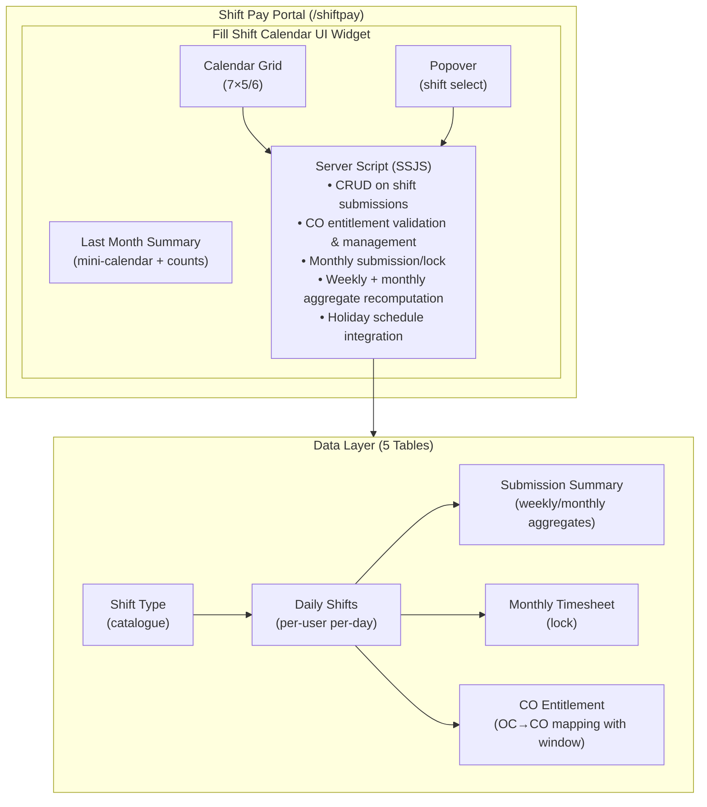

# 🕐 Shift Pay Management

A ServiceNow scoped application for tracking shift work, managing compensatory off (CO) entitlements, and automating pay calculations. Employees log daily shifts through an interactive calendar portal, and the system handles aggregation, entitlement tracking, and monthly submission workflows.

---

## 📋 Table of Contents

- [Overview](#overview)
- [Features](#features)
- [Architecture](#architecture)
- [Data Model](#data-model)
- [Service Portal](#service-portal)
- [Roles & Security](#roles--security)
- [Navigation](#navigation)
- [Installation](#installation)
- [Configuration](#configuration)
- [Usage](#usage)
- [Contributing](#contributing)

---

## Overview

| Property | Value |
|----------|-------|
| **App Name** | Shift Pay Management |
| **Scope** | `x_1995110_shift_0` |
| **Version** | 1.0.0 |
| **Platform** | ServiceNow |
| **Portal URL** | `/shiftpay` |

Shift Pay Management streamlines the process of logging shift work, calculating pay, and managing compensatory off entitlements. Built on the ServiceNow platform, it provides a self-service portal experience for employees and administrative oversight for managers.

---

## Features

### 🗓️ Interactive Calendar
- 7-column weekly grid layout with month-by-month navigation
- Color-coded shift type pills for quick visual identification
- Click-to-edit single-day popovers with shift type selection and comments
- **Bulk Edit Mode** — multi-select weekdays and apply a shift type in one action

### 💰 Automated Pay Calculation
- Real-time aggregation of weekly and monthly totals
- Rate snapshot at time of computation ensures historical accuracy
- Automatic recomputation on every save/clear action

### 🔄 CO Entitlement Tracking
- Compound OC shifts (OC+CO, OC+UK+CO, OC+US+CO) automatically generate CO entitlements
- 7-weekday window enforcement for CO usage
- Standalone CO only available when valid entitlements exist

### 📅 Monthly Submission Workflow
- Submit button available only when all weekdays are logged
- Submission window: last weekday of month → 2nd weekday of next month
- Month locking prevents edits after submission

### 📱 Responsive Design
- Full mobile support with CSS media queries
- Bottom-sheet popovers on mobile devices
- Keyboard navigation (Escape to close/exit modes)

### 🏖️ Holiday Awareness
- Integrates with ServiceNow schedule tables (`cmn_schedule`)
- Automatically adjusts available shift types on holidays/weekends

---

## Architecture

---

## Data Model

### Daily Shifts (`x_1995110_shift_0_u_shift_submission`)

The core transactional table — one record per user per day.

| Field | Type | Description |
|-------|------|-------------|
| `number` | String | Auto-generated record number |
| `u_user` | Reference → `sys_user` | The employee |
| `u_date` | Date | The shift date |
| `u_shift_type` | Reference → `shift_type` | Which shift was worked |
| `u_comment` | String (200) | Optional notes |

### Shift Type (`x_1995110_shift_0_shift_type`)

Configuration table defining available shift types and their pay rates.

| Field | Type | Description |
|-------|------|-------------|
| `name` | String | Display code (e.g., "UK", "US", "L", "OC", "CO"). **Cosmetic only** — no logic branches on it. |
| `description` | String | Display label |
| `rate` | Float | Pay rate per shift |
| `currency` | Reference → `fx_currency` | Currency for the rate |
| `active` | Boolean | Whether shift type is available |
| `color_hex` | String | Chip colour (`#rrggbb`); the pale cell tint is derived from it. |
| `oc_role` | Choice | `none` / `grants_co` (compound-OC shifts that earn a CO) / `consumes_co` (the standalone CO). Drives entitlement logic. |
| `allow_weekday` | Boolean | Selectable on a plain weekday. |
| `allow_weekend_holiday` | Boolean | Selectable on a weekend or declared holiday. |
| `day_category` | Choice | `regular` / `off` / `holiday` — UI grouping and legend. |

> **Semantics are data-driven.** Availability, UI grouping, colour, and CO-entitlement
> behaviour all come from the columns above — never from the `name` string. Renaming a
> shift type is purely cosmetic and changes no behaviour. Adding a new shift type only
> requires setting these columns. The widget shows a config-error banner if a shift type
> is missing `day_category`, or if CO entitlement is enabled but no row has
> `oc_role = consumes_co`.

**Available Shift Types:**

| Code | Description | Availability |
|------|-------------|--------------|
| UK | UK shift | Weekdays only |
| US | US shift | Weekdays only |
| L | Leave | Weekdays only |
| OC | On-Call | Weekends/Holidays |
| CO | Compensatory Off | Weekdays (with valid entitlement) |
| OC+CO | On-Call + CO | Weekends/Holidays |
| OC+UK+CO | On-Call + UK + CO | Weekends/Holidays |
| OC+US+CO | On-Call + US + CO | Weekends/Holidays |

### Monthly Timesheet (`x_1995110_shift_0_monthly_timesheet`)

Tracks per-month submission and lock status.

| Field | Type | Description |
|-------|------|-------------|
| `u_user` | Reference → `sys_user` | The employee |
| `u_year` | Integer | Calendar year |
| `u_month` | Integer | Month (1 = January) |
| `u_submitted_on` | DateTime | Timestamp of submission |

### Shift Submission Summary (`x_1995110_shift_0_shift_submission_summary`)

Aggregated pay calculations per shift type per period.

| Field | Type | Description |
|-------|------|-------------|
| `u_user` | Reference → `sys_user` | The employee |
| `u_period_type` | Choice | "week" or "month" |
| `u_period_start` | Date | Monday of week or 1st of month |
| `u_year` | Integer | Calendar year |
| `u_month` | Integer | Month number |
| `u_shift_type` | Reference → `shift_type` | The shift category |
| `u_count` | Integer | Number of shifts in period |
| `u_rate_snapshot` | Decimal | Rate at time of computation |
| `u_amount` | Decimal | `count × rate` |
| `u_currency` | String | Currency code |

### Shift CO Entitlement (`x_1995110_shift_0_shift_co_entitlement`)

Tracks CO entitlements earned from compound OC shifts.

| Field | Type | Description |
|-------|------|-------------|
| `u_user` | Reference → `sys_user` | The employee |
| `oc_date` | Date | Date the OC shift was worked |
| `u_oc_entry` | Reference → `u_shift_submission` | The OC submission record |
| `u_oc_window_end` | Date | Deadline to use the CO (7 weekdays) |
| `u_co_date` | Date | Date CO was consumed (null if unused) |
| `u_co_entry` | Reference → `u_shift_submission` | The CO submission record |

---

## Service Portal

### Portal Details

| Property | Value |
|----------|-------|
| **Portal Name** | Shift Pay Portal |
| **URL Suffix** | `/shiftpay` |
| **Page** | Fill Shift (`fill_shift`) |
| **Widget** | Fill Shift Calendar UI (`fill-shift-calendar-ui`) |

### Widget Configuration Options

| Option | Default | Description |
|--------|---------|-------------|
| `title` | "My Shift Submissions" | Widget heading |
| `subtitle` | "India ops · Logging shifts worked..." | Context line |
| `tooltip` | "Log the shift you worked each day..." | Info icon tooltip |
| `enable_co_entitlement` | `true` | When off, skips all CO entitlement logic; CO/compound-OC shifts behave as ordinary shifts. |
| `shift_table` | `u_shift_submission` | Day-entry table |
| `lock_table` | `u_shift_submission_lock` | Month-lock table |
| `catalog_table` | `u_shift_type_catalog` | Shift catalogue table |
| `summary_table` | `u_shift_submission_summary` | Aggregate summary table |
| `entitlement_table` | `u_shift_co_entitlement` | CO entitlement table |

---

## Roles & Security

### Roles

| Role | Scope | Description |
|------|-------|-------------|
| `x_1995110_shift_0.admin` | Application | Full CRUD access to all tables |
| `x_1995110_shift_0.user` | Application | Standard employee access |

### Access Control Matrix

| Table | Create | Read | Write | Delete |
|-------|--------|------|-------|--------|
| **Daily Shifts** | admin, user | admin, user | admin, user | admin |
| **Monthly Timesheet** | admin, user | admin, user | admin, user | admin |
| **Shift Submission Summary** | admin | admin, user | admin | admin |
| **Shift CO Entitlement** | admin | admin, user | admin | admin |

> **Note:** Users can create, read, and write their own shift submissions but cannot delete them. Only admins can manage summaries and entitlement records directly.

---

## Navigation

The application adds a navigation menu in the Application Navigator:

| # | Module | Target |
|---|--------|--------|
| 1 | Daily Shifts | List view of shift submissions |
| 2 | Shift Summaries | List view of aggregated summaries |
| 3 | Monthly Timesheets | List view of monthly submissions |
| 4 | CO Entitlement Mappings | List view of CO entitlements |
| 5 | Shift Types | Configuration list of shift types |

---

## Installation

### Prerequisites

- ServiceNow instance (Washington DC or later recommended)
- Admin access to install scoped applications
- Service Portal plugin activated

### Steps

1. Import the application from source control into your ServiceNow instance
2. Navigate to **System Applications → Studio** and open the application
3. Ensure the application is active
4. Assign roles to users:
   - `x_1995110_shift_0.admin` — for administrators
   - `x_1995110_shift_0.user` — for employees

---

## Configuration

### Holiday Schedule

The application reads holidays from a ServiceNow schedule. Configure the holiday schedule system property:

| Property | Value |
|----------|-------|
| `x_shiftpay.holiday_schedule` | Set to the `sys_id` of your `cmn_schedule` record |

### Shift Types

Navigate to **Shift Pay Management → Shift Types** in the Application Navigator to:
- Add new shift types with rates and currencies
- Activate/deactivate shift types
- Modify pay rates

### Portal Access

Access the employee portal at: `https://<instance>.service-now.com/shiftpay`

---

## Usage

### For Employees

1. Navigate to `/shiftpay` on your instance
2. Use the calendar to navigate to the desired month
3. **Single Entry:** Click a day → select shift type → optionally add a comment → save
4. **Bulk Entry:** Click "Bulk Edit" → select multiple weekdays → choose a shift type → apply
5. **Submit Month:** Once all weekdays are logged, click "Submit" within the submission window

### For Administrators

1. Navigate to **Shift Pay Management** in the Application Navigator
2. Review **Daily Shifts** for individual entries
3. Check **Shift Summaries** for aggregated pay calculations
4. Monitor **Monthly Timesheets** for submission status
5. Review **CO Entitlement Mappings** for compensatory off tracking

---

## Business Rules

### Shift Availability

| Day Type | Available Shifts |
|----------|-----------------|
| Weekday | UK, US, L, Not Eligible, CO (if entitled) |
| Weekend/Holiday | OC, OC+CO, OC+UK+CO, OC+US+CO |

### CO Entitlement Rules

1. Working a compound OC shift (OC+CO, OC+UK+CO, OC+US+CO) earns one CO entitlement
2. The CO must be used within the next **7 weekdays** (excluding weekends/holidays)
3. Standalone CO selection is only available when a valid, unused entitlement exists
4. Each entitlement can only be consumed once

> **Optional feature.** CO entitlement can be turned off entirely via the
> `enable_co_entitlement` widget option (set `false`). For a deployment that doesn't use
> CO, also deactivate the OC/CO catalogue rows — because availability is data-driven they
> then simply disappear from the calendar with no code change.

### Submission Window

- **Opens:** Last weekday of the current month
- **Closes:** 2nd weekday of the following month
- **Requirement:** All weekdays in the month must have a shift logged

---

