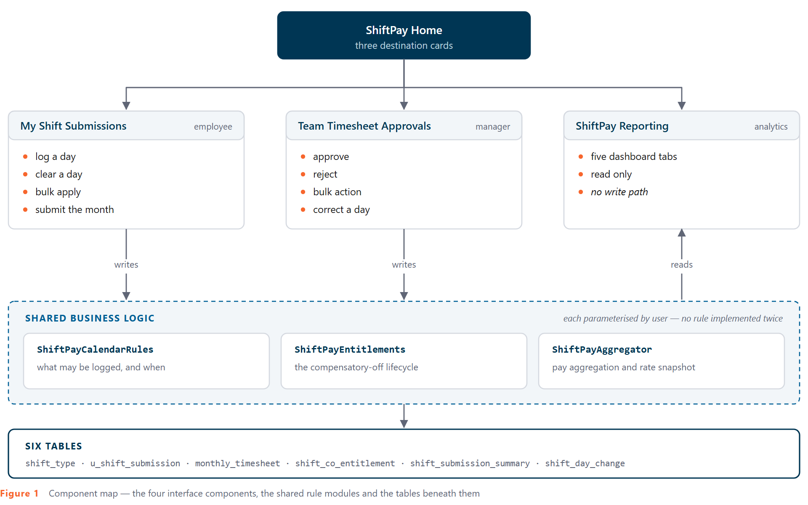
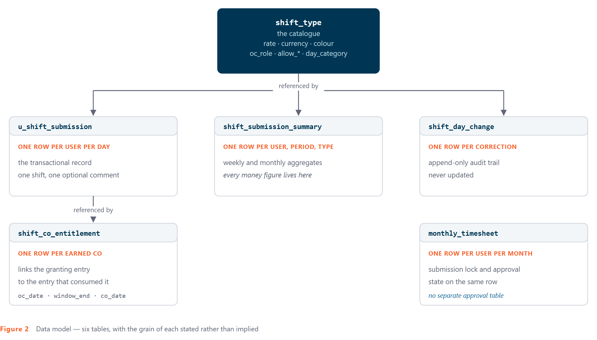
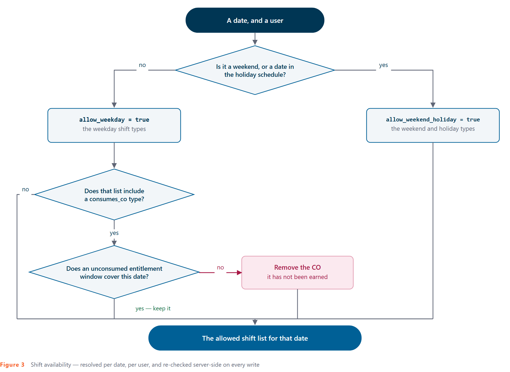
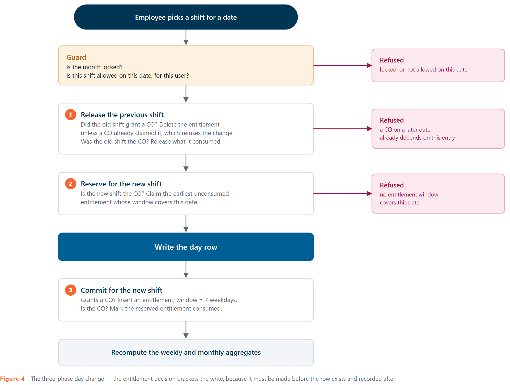
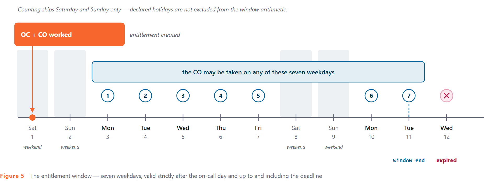
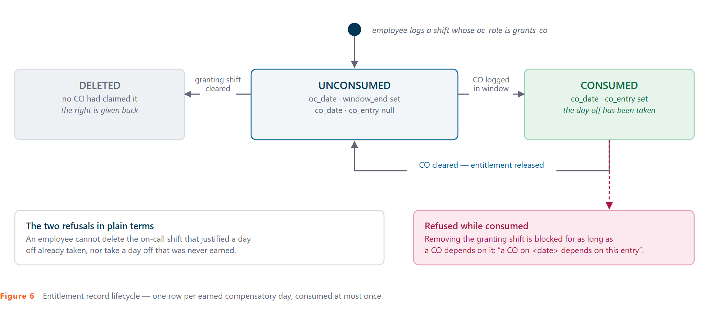
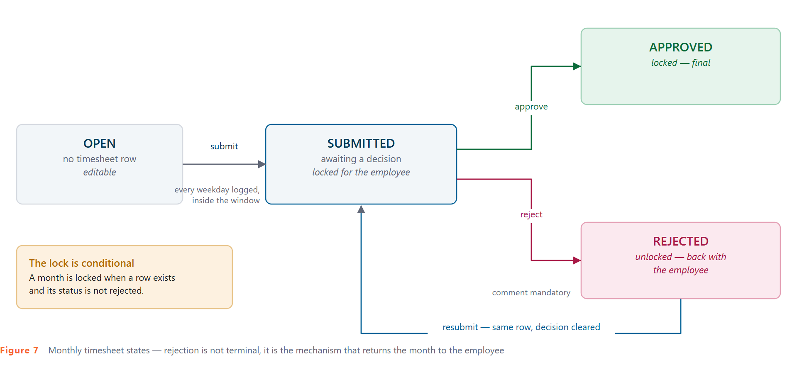
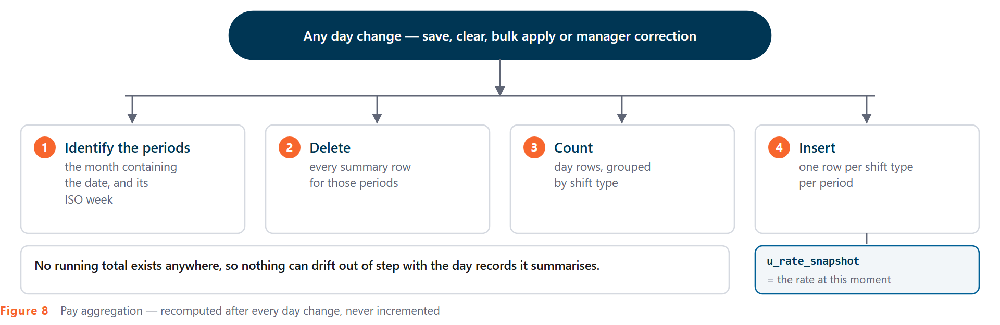
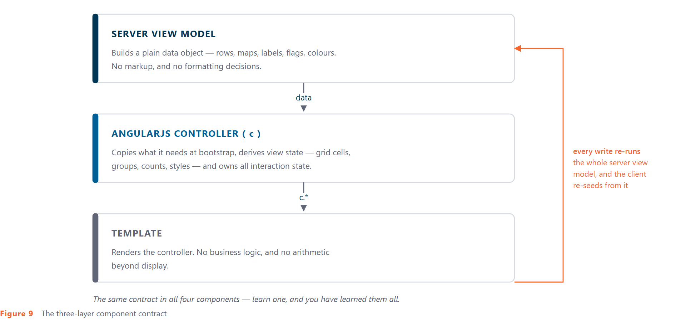

# ShiftPay — Technical Design Document

**Futuristic Technologies** · *Decode the future*

**Product:** Shift Pay Management
**Document type:** Technical Design Document
**Version:** 1.0
**Classification:** Confidential — prepared by Futuristic Technologies. Not to be redistributed without written consent.

---

## Contents

**Part I — Domain**

1. Introduction
2. Solution overview
3. Data model
4. Shift types — the configuration engine
5. Shift submission — the daily record
6. Compensatory-off entitlement
7. Monthly submission and approval
8. Pay computation

**Part II — User interface**

9. Interface architecture
10. AngularJS implementation
11. Styling architecture
12. Data visualisation
13. Interaction patterns
14. Accessibility

**Part III — Delivery**

15. Configuration
16. Quality assurance
17. Conventions

Appendix A — Table reference
Appendix B — Interface state reference
Appendix C — Source inventory
Appendix D — Open findings

---

# Part I — Domain

## 1. Introduction

### 1.1 Purpose

This document describes the technical design of **ShiftPay** — a shift-logging, entitlement-tracking and pay-computation application. It covers the data model, the business rules that govern shift eligibility and compensatory-off entitlement, the submission and approval workflow, the pay aggregation method, and the implementation of the four user-interface components that expose all of it.

It is written for developers, technical reviewers and handover recipients.

### 1.2 What the product does

Employees log one shift per working day against a configurable catalogue of shift types. Certain shift types earn a **compensatory-off (CO) entitlement** — a right to take a day off within a bounded window. Others consume that right. At month end the employee submits a timesheet; a manager approves it, rejects it, or corrects individual days with a recorded reason. Pay is computed per shift type per period, against a rate captured at the moment of computation.

### 1.3 Platform context

The application is hosted on a ServiceNow Service Portal instance, in the scoped application `x_1995110_shift_0`. Platform specifics are kept to a minimum in this document; where the platform constrains the design, the constraint is stated because it shaped the implementation.

---

## 2. Solution overview

### 2.1 Component map and data flow



Every rule lives in one of the three shared modules, each parameterised by user. The employee widget calls them for the signed-in user; the manager widget calls the *same* modules for a reportee. There is no second implementation of any rule — a duplicated entitlement rule would mean two records of who owes whom a day off, and a duplicated pay rule would be a pay defect.

### 2.2 Roles

| Role | Grants |
|---|---|
| `x_1995110_shift_0.user` | Standard employee access — log shifts, submit own timesheet |
| `x_1995110_shift_0.admin` | Administration; also the default role gating organisation-wide reporting |

Manager capability is not a role. It is derived from the reporting relationship on the user record, re-checked server-side before every manager write.

---

## 3. Data model

### 3.1 Entity relationships



### 3.2 The six tables

| Table | Grain | Purpose |
|---|---|---|
| `x_1995110_shift_0_shift_type` | One row per shift type | The catalogue. Rates, colours and **all shift semantics** |
| `x_1995110_shift_0_u_shift_submission` | One row per user per day | The core transactional record |
| `x_1995110_shift_0_monthly_timesheet` | One row per user per month | Submission lock **and** approval state |
| `x_1995110_shift_0_shift_co_entitlement` | One row per earned CO | Links the granting shift to the CO it entitles |
| `x_1995110_shift_0_shift_submission_summary` | One row per user, period, shift type | Weekly and monthly pay aggregates |
| `x_1995110_shift_0_shift_day_change` | One row per manager correction | Append-only audit trail |

Full field listings are in **Appendix A**.

### 3.3 Two structural decisions worth stating

**There is no separate approval table.** Approval state (`status`, `approver`, `actioned_on`, `manager_comment`) lives on the monthly timesheet row alongside the submission lock. One employee-month is one row, always — resubmission after a rejection reuses the existing row rather than inserting a second one, so the history of a month cannot fork.

**Money lives only in the summary table.** Every monetary figure the application displays is read from `u_amount` and `u_rate_snapshot` on `shift_submission_summary`, never computed live from catalogue rates. This is what makes a rate change safe: it affects future computations and leaves everything already approved exactly as the manager approved it.

---

## 4. Shift types — the configuration engine

### 4.1 Semantics are data, not code

The shift type catalogue is the single most important table in the application, because it is not merely a list of options — it is where behaviour is configured. Adding a shift type requires **no code change at all**.

Meaning is carried in semantic columns and keyed by record identity. The `name` column (`UK`, `OC`, `CO`) is **cosmetic**; nothing in the application branches on it. Renaming a shift type changes nothing.

| Column | Values | Governs |
|---|---|---|
| `oc_role` | `none` / `grants_co` / `consumes_co` | Whether working this shift **earns** a CO entitlement, **spends** one, or neither |
| `allow_weekday` | boolean | Selectable on a plain weekday |
| `allow_weekend_holiday` | boolean | Selectable on a weekend or declared holiday |
| `day_category` | `regular` / `off` / `holiday` | Grouping and legend presentation |
| `color_hex` | `#rrggbb` | Chip colour; the pale day-cell tint is *derived* from it, not stored |
| `rate` / `currency` | decimal / reference | Pay per shift of this type |
| `active` | boolean | Whether it is offered at all |

### 4.2 The active catalogue

| Code | `oc_role` | Weekday | Weekend / holiday | `day_category` |
|---|---|---|---|---|
| UK | none | yes | no | regular |
| US | none | yes | no | regular |
| L | none | yes | yes (!) | off |
| Not Eligible | none | yes | yes (!) | off |
| CO | **consumes_co** | yes | no | holiday (!) |
| OC | none | no | yes | holiday |
| OC + CO | **grants_co** | no | yes | holiday |
| OC + UK + CO | **grants_co** | no | yes | holiday |
| OC + US + CO | **grants_co** | no | yes | holiday |

(!) The three marked values are current data that diverges from documented intent — see Appendix D.

### 4.3 How availability is resolved for a date



The result is delivered to the browser as a map of date → permitted shift types, and the interface filters its dropdowns from it. **That filtering is convenience, not control.** Every write independently re-validates the same rule server-side, because the client call is reachable from a browser console with any payload.

### 4.4 Configuration validation

The catalogue is validated on every load. A banner is shown, and the interface degrades safely, if any active shift type is missing `day_category`, or if CO entitlement is enabled but no shift type carries `consumes_co` — a configuration in which the entitlement feature would silently do nothing.

---

## 5. Shift submission — the daily record

### 5.1 The unit of work

One employee, one date, one shift type, optionally one comment. That is the entire transactional record. The comment belongs to the employee and is never overwritten by a manager correction — a manager's reasoning goes to the audit table instead.

### 5.2 The day-save sequence

A day change is never a single write. Because a shift can grant or spend an entitlement, and because the entitlement decision must be made *before* the day row exists but recorded *after* it does, every day change brackets the write in three phases:



Both refusal points are genuine business protections. Phase 1 prevents an employee from deleting the on-call shift that justified a day off they have already taken. Phase 2 prevents a day off being taken that was never earned.

### 5.3 Bulk apply

Bulk apply exists for the common case of a month of identical weekday shifts. Two rules constrain it:

1. **Entitlement-bearing shifts are refused in bulk.** Shift types carrying `grants_co` or `consumes_co` must be logged one day at a time — the three-phase validation above is per-day and cannot be meaningfully applied across a selection.
2. **The offered list is the intersection** of what is permitted on *every* selected date, so a bulk action cannot be assembled that would be refused partway through.

---

## 6. Compensatory-off entitlement

This is the most intricate rule set in the application, and the one with the most direct consequences: it tracks who is owed a day off.

### 6.1 The rules

1. Working a compound on-call shift (`OC + CO`, `OC + UK + CO`, `OC + US + CO`) earns **one** CO entitlement.
2. The CO must be taken within **7 weekdays** following the on-call date.
3. A standalone CO is selectable only on a date covered by a valid, unused entitlement.
4. An entitlement is consumed once. Saving a CO consumes the **earliest** eligible entitlement.
5. Clearing or changing an entry releases or deletes the entitlement accordingly.
6. Removing an on-call entry that a CO already depends on is **refused**.

### 6.2 The window

The window end is calculated by counting forward seven days that are **not Saturday or Sunday**. An entitlement covers a date when `oc_date < date <= window_end` — strictly after the on-call day, up to and including the deadline.



> **Implementation note.** The counting function skips Saturday and Sunday only. Declared holidays are **not** excluded from the window arithmetic, although they are excluded from shift availability. Where prior documentation states that holidays extend the window, the behaviour described here is what the system does.

### 6.3 Entitlement record lifecycle



### 6.4 Feature flag

The entire entitlement system is governed by a single configuration switch. When disabled, every entitlement branch is skipped end to end and the on-call and CO shift types behave as ordinary shifts. The interface presents no disabled or dead controls in that configuration — the availability rules simply resolve to a simpler catalogue.

---

## 7. Monthly submission and approval

### 7.1 Timesheet state machine



**The lock is conditional**, and this is the detail that matters: a month is locked when a timesheet row exists **and** its status is not `rejected`. Rejection is therefore not a terminal state — it is the mechanism that returns the month to the employee.

### 7.2 Manager actions

| Action | Permitted when | Constraints |
|---|---|---|
| Approve | status is `submitted` | Comment optional |
| Reject | status is `submitted` | Comment **mandatory**; reopens the month |
| Bulk approve / reject | per row, as above | Iterates the single-row path, so every check applies per row |
| Correct a day | status is `submitted` only | Reason mandatory; re-validated against availability rules |

**Approved is final and rejected is with the employee** — day correction applies only to a month awaiting a decision.

### 7.3 Day correction

A manager may fix a mistake; a manager may not mint an exception. Before any correction is written the system verifies the reporting relationship, demands a reason, confirms the date falls inside the displayed month, and re-validates the replacement shift against the availability rules **for that employee** — the same rules the employee would have faced. It then runs the identical three-phase entitlement transaction described in §5.2, writes an audit row, and recomputes that employee's aggregates.

The audit row records the previous shift, the new shift, the reason, who changed it and when. The employee's own comment on the day is left untouched.

### 7.4 Bulk actions

Bulk approve and reject iterate the per-row action rather than issuing a single mass update, so every authorisation and state guard applies to every row. The per-row function *returns* its refusal rather than raising it — the single-row path shows it immediately, and the bulk path collects distinct reasons into one summary. Selection is derived from the rows currently **visible** after tab and search filtering, so a row the manager cannot see can never be swept into a bulk decision.

---

## 8. Pay computation

### 8.1 Aggregates are recomputed, never incremented



There is no running total anywhere in the system, and therefore nothing that can drift out of step with the day records it claims to summarise.

### 8.2 The rate snapshot

`u_rate_snapshot` captures the catalogue rate at computation time and `u_amount` is derived from it. A subsequent rate change does not rewrite history: figures already computed keep the rate that was in force, which is what a manager approved and what payroll acted upon.

### 8.3 Two rules for every consumer

Any downstream consumer — the dashboard, an export, an external reporting tool — must observe both:

1. **Money comes from `u_amount` / `u_rate_snapshot`**, never from live catalogue rates.
2. **Money measures must filter `u_period_type = 'month'`.** Week rows are clipped to the month at its edges; summing both period types double-counts.

### 8.4 Known limitation

The rate map is built from **active** catalogue rows. A shift type deactivated after being logged will re-aggregate at zero. This is preserved deliberately and recorded here rather than silently patched, because changing it would alter historical figures.

---

# Part II — User interface

Four components, all hand-built. There is no off-the-shelf calendar, grid or dashboard library anywhere in the product — every surface is authored HTML, AngularJS and SCSS.

| Layer | Delivered as | Lines |
|---|---|---|
| HTML templates | 4 templates | 1,622 |
| AngularJS controllers | 4 controllers | 1,772 |
| SCSS stylesheets | 4 stylesheets | 2,828 |
| **Front-end total** | | **6,222** |

---

## 9. Interface architecture

### 9.1 The four components

| Component | Purpose | Front-end lines |
|---|---|---|
| **ShiftPay Home** | Landing screen; personalised greeting, three destination cards | 368 |
| **My Shift Submissions** | Month calendar, day popover, bulk edit, live summary, submission | 1,804 |
| **Team Timesheet Approvals** | Manager queue, review drill-in, single and bulk actions, day correction, decision history | 2,149 |
| **ShiftPay Reporting** | Five-tab analytics dashboard — trend, mix, team, activity heatmap, timeliness | 1,901 |

### 9.2 The three-layer contract

Every component follows one contract, applied identically across all four. This consistency is the most important architectural decision in the front end: a developer who learns one component has learned all four.



### 9.3 Write path and state reconciliation

All writes route through a single asynchronous call that re-executes the server view model and returns a **complete, fresh `data` object**. The controller then re-seeds from that response.

This is a deliberate rejection of optimistic UI, and the reason is recorded in the approval controller:

> *After a write we re-seed from the response rather than patching optimistically — an approve can legitimately be refused server-side (stale screen, someone else got there first), and the row must then show what the server says, not what we hoped.*

The calendar controller applies the same principle with a targeted refresh: it patches its local maps from the authoritative response, then calls `c.refresh()` → `c.recalc()` to rebuild every derived value rather than incrementally adjusting counters. Recomputation from a known-good source is cheaper to reason about than incremental patching, and it cannot drift.

### 9.4 Action vocabulary

Each component exposes a small, named action set rather than generic CRUD:

| Component | Actions |
|---|---|
| Calendar | `saveDay`, `clearDay`, `bulkSave`, `submitMonth`, `loadMonth` |
| Approvals | `approve`, `reject`, `bulkApprove`, `bulkReject`, `correctDay`, `loadMonth`, `loadHistory` |
| Reporting | Scope, month-span and tab re-reads only — **no write path at all** |

---

## 10. AngularJS implementation

### 10.1 Framework profile

AngularJS 1.x, controller-as syntax with the alias `c`. Components are supplied to the runtime as **controller factory functions**, not registered modules. This has a direct design consequence, recorded in the reporting controller:

> *A widget client script is a controller factory — there is no module to register a directive on — so the canvases are found by class inside `$element` rather than by id. That is also what makes two instances of this widget on one page safe: ids would collide, `$element` does not.*

No custom directives, no services, no module registry. Every behaviour is implemented within controller scope and template bindings, with `$element` used for the small number of measurement and focus operations that need real DOM access.

### 10.2 Directive usage across the four templates

| Directive | Uses | Applied to |
|---|---|---|
| `ng-if` | 161 | Conditional panels, banners, empty states, dialogs — preferred over `ng-show` so hidden branches are not in the DOM at all |
| `ng-click` | 49 | All interaction entry points |
| `ng-class` | 40 | State modifiers (`--selected`, `--today`, `--open`, `--todo`) |
| `ng-repeat` | 35 | Grids, lists, tabs, legend groups — **always with `track by`** |
| `ng-bind` | 30 | Text output where interpolation braces would flash before compile |
| `ng-disabled` | 24 | Lock states, in-flight guards |
| `ng-style` | 20 | Catalogue-driven colour, computed popover placement |
| `ng-model` / `ng-change` | 11 | Comment fields, search, correction reason |
| `ng-href`, `ng-keydown`, `ng-checked`, `ng-maxlength` | 10 | Navigation, keyboard, bulk selection, input limits |

**Digest discipline.** Every `ng-repeat` carries an explicit `track by` against a stable identity — `track by t.key`, `track by cell.idx`, `track by row.userId`. This prevents full DOM teardown on each refresh of the calendar grid, the approval table and the legend, the three surfaces that re-render most often. One-time bindings (`{{::c.options.subtitle}}`) are used for values fixed at bootstrap, keeping them out of the watch list entirely.

### 10.3 Derived view state

Controllers do not ask templates to compute. The calendar's `recalc()` is one ordered pass producing every number the interface shows:

1. Logged days and total working days for the footer progress line
2. Bulk selection count
3. Per-shift-type counts for the current month
4. Per-shift-type counts for the previous month comparison
5. The **intersection** of allowed shift types across every selected day — so bulk edit offers only shifts legal on *all* selected dates

`buildCells()`, `buildLastMonth()`, `buildLegendGroups()` and `buildGroupedDropdownList()` complete the pattern: the template iterates finished arrays.

### 10.4 Colour derivation in the client

Shift colour is data, not CSS (§4.1). The catalogue supplies a hex value; the controller derives the pale cell tint from it at runtime rather than storing a second colour:

```js
// Lighten a #rrggbb hex toward white by `amount` (0–1) for cell backgrounds.
function softTint(hex, amount) {
  var m = /^#?([0-9a-fA-F]{6})$/.exec(hex || '');
  if (!m) return '#E5E7EB';
  var n = parseInt(m[1], 16);
  var r = (n >> 16) & 255, g = (n >> 8) & 255, b = n & 255;
  r = Math.round(r + (255 - r) * amount);
  g = Math.round(g + (255 - g) * amount);
  b = Math.round(b + (255 - b) * amount);
  return 'rgb(' + r + ',' + g + ',' + b + ')';
}
```

The chip takes the full-strength colour, the day cell takes `softTint(color, 0.88)`, and both are applied through `ng-style`. Adding a shift type to the catalogue therefore produces a correctly coloured chip, a correctly tinted cell, a legend entry and a grouped dropdown entry with **no front-end change at all**.

Grouping is equally data-driven — the controller maps stable category codes to display labels and a fixed order:

```js
var GROUP_LABELS = {
  'regular': 'Regular shifts',
  'off':     'Off / Not eligible',
  'holiday': 'Holiday work (weekend or declared holiday)'
};
var GROUP_ORDER = ['regular', 'off', 'holiday'];
```

### 10.5 Popover placement

The day-entry popover is positioned by measurement, and collision-flips on both axes inside the calendar grid:

```js
function positionPopover(cellEl) {
  if (!cellEl) return;
  // On mobile the popover is a fixed bottom sheet; CSS handles placement
  if (window.innerWidth <= 760) { c.popoverStyle = {}; return; }
  var gr = cellEl.parentNode.getBoundingClientRect();
  var cr = cellEl.getBoundingClientRect();
  var POPOVER_W = 280, POPOVER_H_ESTIMATE = 300, GAP = 6;

  var left = cr.left - gr.left;
  var top  = cr.bottom - gr.top + GAP;

  // flip horizontally if would overflow the right edge of the grid
  if (left + POPOVER_W > gr.width) left = cr.right - gr.left - POPOVER_W;
  // flip vertically if would overflow the bottom of the grid
  if (top + POPOVER_H_ESTIMATE > gr.height + 20) {
    top = cr.top - gr.top - POPOVER_H_ESTIMATE - GAP;
    if (top < 0) top = 0;
  }
  c.popoverStyle = { left: left + 'px', top: top + 'px' };
}
```

Two details matter. Measurement is **relative to the grid**, not the viewport, so the popover travels correctly inside a scrolling page. And below the 760px breakpoint the function abdicates entirely, handing placement to CSS — the same component becomes a native-feeling bottom sheet on mobile without a second code path (§11.4).

### 10.6 Focus and keyboard

The component root is focusable and owns a keyboard handler, with a layered Escape that unwinds the interface one state at a time, in the reverse order the user built it:

```js
c.onKeydown = function ($event) {
  if ($event.key === 'Escape') {
    if (c.dropdownOpen)      { c.dropdownOpen = false; }
    else if (c.legendOpen)   { c.legendOpen = false; }
    else if (c.bulkMode)     { c.exitBulk(); }
    else if (c.openCellKey)  { c.closePopover(); }
  }
};
```

`$timeout` focuses the root after compile, so the Escape binding is live without the user first clicking into the component — removing a real dead-end in keyboard-only use.

---

## 11. Styling architecture

### 11.1 Scale and conventions

| Stylesheet | Root selectors | Design tokens |
|---|---|---|
| My Shift Submissions | 100 | 11 |
| Team Timesheet Approvals | 106 | 17 |
| ShiftPay Reporting | 72 | 16 |
| ShiftPay Home | 17 | 8 |
| **Total** | **295** | **52** |

Naming is **BEM-light** — `.block`, `.block__element`, `.block--modifier` — with every custom selector namespaced per component (`shift-`, `shift-mgr-`, `shift-rep-`, `shift-home-`). Nothing leaks into the surrounding page, and nothing in the surrounding page can accidentally match a component internal.

### 11.2 Design tokens as CSS custom properties

Each component declares its palette, radii and surfaces as custom properties on its root element:

```scss
.shift-widget {
  --shift-text:       #0F172A;
  --shift-text-mute:  #64748B;
  --shift-text-faint: #94A3B8;
  --shift-border:     #E5E7EB;
  --shift-surface:    #FFFFFF;
  --shift-bg-subtle:  #F8FAFC;

  --shift-radius:      8px;
  --shift-radius-sm:   4px;
  --shift-radius-pill: 999px;
}
```

Because these are runtime custom properties rather than compile-time variables, a page or theme can override them per instance **without recompiling the stylesheet**. Reskinning is a cascade override, not a rebuild.

Note what is *not* a token: shift colours. Those come from the catalogue and are applied through bindings (§10.4). The stylesheet defines structure and neutral surfaces; the data defines meaning.

### 11.3 A deliberate constraint — flat SCSS

The most consequential styling decision in the build is to write the stylesheets as **flat, non-nested SCSS**. The reason is documented at the head of every file:

> *This file is intentionally written as FLAT plain CSS (no `&__suffix`, no nested selectors, no `@media` nested inside selectors). The bundled LibSass build does not support Sass 3.3+ parent-selector concatenation, so `&__title` silently fails the whole compile and the component falls back to inline-only styling.*

The failure mode this avoids is the worst kind: the compile does not error, it silently produces nothing, and the interface renders unstyled in production while looking perfect in a local editor. The mitigation is a convention applied consistently — no `&` concatenation, no nested selectors, no nested media queries, no double-slash line comments — and it holds across all 295 selectors.

Keyframes follow the same rule and are prefixed against collision with portal-wide animation names:

```scss
/* Animations (top-level — never nested)
   Prefixed with `shift` to avoid colliding with portal-wide keyframes. */
@keyframes shiftSlideUpBottom {
  from { transform: translateY(100%); }
  to   { transform: translateY(0); }
}
```

### 11.4 Responsive design

Breakpoints are declared per component at the point where its own layout actually breaks, rather than borrowed from a framework grid:

| Component | Breakpoints | Behaviour |
|---|---|---|
| My Shift Submissions | 760px | Popover becomes a fixed bottom sheet with slide-up animation and backdrop; chips and dates shrink; bulk bar stacks vertically |
| Team Timesheet Approvals | 767px | Queue table reflows; stat strip wraps; dialogs go full-width |
| ShiftPay Reporting | 767px | Paired half-width charts stack; heatmap scrolls horizontally within its wrapper |
| ShiftPay Home | 900px, 700px | Three-card grid → two-up → single column |

The mobile popover transformation is the clearest example of responsive design done at component level rather than by hiding elements:

```scss
@media (max-width: 760px) {
  .shift-popover {
    position: fixed !important;
    left: 0 !important; right: 0 !important;
    bottom: 0 !important; top: auto !important;
    width: 100% !important;
    border-radius: 16px 16px 0 0;
    box-shadow: 0 -8px 32px rgba(15, 23, 42, 0.22);
    animation: shiftSlideUpBottom 0.2s ease;
  }
}
```

Same markup, same controller, same state — a different physical interface.

### 11.5 Motion

Transitions are short and functional: 80–140ms on border, shadow and background for hover and focus feedback; 150–200ms for the entrance of the mobile sheet and its backdrop. Motion explains a state change; it is never decoration.

Reduced-motion preference is respected:

```scss
@media (prefers-reduced-motion: reduce) {
  .shift-home__card { transition: none; }
  .shift-home__card:hover { transform: none; }
}
```

---

## 12. Data visualisation

The reporting dashboard is the most technically demanding surface in the build, because it places a canvas-rendering chart library inside a framework that owns the DOM around it.

### 12.1 Chart lifecycle

The reconciliation strategy is stated at the head of the controller:

> *Chart.js owns a `<canvas>`; AngularJS owns the DOM around it. The two are reconciled by rebuilding, not by patching: a tab switch destroys the chart it is leaving and constructs the one it is entering, on a `$timeout` so the canvas `ng-if` has actually rendered first. Charts left alive behind a removed canvas leak their resize listeners and eventually redraw into nothing, which is the bug this avoids.*

Three techniques follow:

1. **Destroy-then-construct on tab change**, never patch a live chart instance.
2. **`$timeout` sequencing**, so construction happens after the `ng-if` branch has produced a real canvas.
3. **Class-based lookup within `$element`**, never by element id — which is what makes two dashboards on one page safe.

### 12.2 Library resolution and graceful degradation

The chart library is resolved through a guarded path with an explicit fallback, and the resolved constructor is cached privately rather than read back from the shared global namespace — because the host page may itself bundle a different version of the same library.

The degradation rule is firm, and is an accessibility position rather than mere error handling:

> *No library, no charts, and a plain-English banner instead of four empty boxes with the numbers still readable underneath.*

Every chart is paired with the figures it draws, and the pairing is ranked explicitly in the markup:

> *Every chart is paired with the numbers it draws. The table and stat tiles below each chart are the source of record and the chart is the summary.*

### 12.3 Choosing not to use the library

The activity view is a **CSS-grid heatmap of styled cells**, not a canvas chart:

> *Chart.js has no native matrix chart and the plugin that adds one is a second dependency; a grid of divs is crisper at this size, selectable, and needs no library at all.*

Its five density steps are token-driven backgrounds — `rgba(15, 23, 42, …)` at 0.20 / 0.40 / 0.62 / 0.85 over a divider-coloured zero state — a monotonic ramp that survives greyscale printing and needs no legend interpolation.

### 12.4 Colour semantics

One rule governs colour across every component:

> *Hue means shift type and nothing else. The mix donut uses catalogue colour; the trend and team charts are ink and slate; red appears only on expired CO, which is a genuine failure state.*

This is why the trend and comparison charts are deliberately monochrome. Giving each month or each person its own hue would put colour into competition with the one meaning it already carries.

---

## 13. Interaction patterns

### 13.1 Progressive disclosure — the day popover

A calendar cell is a button. Clicking it opens an anchored popover carrying the shift dropdown (grouped by category, filtered to what is legal on that date), an optional comment field with a character counter, and save/clear actions. Entering a shift never requires leaving the month view.

### 13.2 Modal bulk edit

Bulk edit is an explicit mode rather than an always-present control surface. Entering it converts cells to checkboxes, reveals a bulk action bar and offers a select-all-weekdays shortcut. The shift list offered is the intersection of what is allowed on every selected day (§10.3), so a bulk action can never be constructed that would be refused on some of its targets. The mode exits by button, by Escape, or on completing an action.

### 13.3 Selection derived from visible rows

In the approval queue, bulk selection is computed from the **currently visible** rows — those surviving the active tab and search filter — not from the full result set. A row filtered off screen cannot be swept into a bulk action the manager cannot see. This is a UI-level safety property implemented in the controller's `selectedIds()` / `actionableCount()` / `allSelected()` trio.

### 13.4 Dialogs with mandatory rationale

Reject (single and bulk) and day correction each open a scoped dialog requiring a typed reason, validated client-side for presence and length before submission and re-validated server-side. Cancel paths (`cancelReject`, `cancelBulkReject`, `cancelCorrect`) restore prior state cleanly rather than leaving partial input behind.

### 13.5 In-flight guards

A single `c.saving` flag disables every action control and applies a busy modifier to the component root for the duration of any write, closing the double-submit window without a spinner overlay.

### 13.6 Outcome banners

Approval outcomes surface at the top of the employee's calendar, directly beneath the header, so the result is read before the grid. Their visual weight is calibrated to the action required:

> *Rejected is assertive (there is something to do); approved is quiet (there is not).*

---

## 14. Accessibility

Accessibility is implemented in markup and controller behaviour rather than bolted on:

- **Semantic roles** — `role="alert"` on refusal and configuration-error banners, `role="status"` on the quiet approved banner, `role="group"` on segmented controls.
- **Labelled controls** — `aria-label` on every icon-only button (month navigation, close, refresh) and on grouped control sets.
- **Keyboard operation** — the component root is focusable and focused programmatically after compile; layered Escape unwinds nested state; all interactive elements are native `<button>` and `<input>`, so tab order and activation come for free.
- **Colour is never the only signal** — shift chips carry their short code as text alongside their colour; approval status pills carry both a glyph and a word.
- **Charts are never the only representation** — every chart is backed by a table or stat tile designated as the source of record.
- **Reduced motion** is honoured.

The landing screen's design QA record confirms the standard was verified in practice: both destinations unique and keyboard reachable, accessible labels identifying action *and* destination, responsive layout verified at 1440 × 1024 and 390 × 844, and no console warnings or errors. One iteration was required — a flex-sizing defect that collapsed the stacked cards at 390 × 844, corrected and both viewports re-verified.

---

# Part III — Delivery

## 15. Configuration

No component hard-codes its labels, its data sources or its behaviour switches. Configuration is declared through an option schema per component and read at render time.

| Component | Options | Notable |
|---|---|---|
| My Shift Submissions | 9 | Title, subtitle, tooltip, entitlement on/off, five table names |
| Team Timesheet Approvals | 12 | Pay visibility, manager relationship field, history depth, entitlement rules, six table names |
| ShiftPay Reporting | 13 | Chart library location, trend length, comparison size, pay visibility, default scope, organisation role |
| ShiftPay Home | 13 | Intro copy plus title / description / link label / target page for each of three cards |

Two switches deserve emphasis as front-end design decisions:

**Pay visibility strips data, it does not hide it.** When manager pay display is disabled, monetary values are omitted from the payload entirely rather than hidden with `ng-if`. A control that hides a value in the template is not a control at all — the value is still in the page source.

**The entitlement switch is a genuine feature flag.** With it off, every entitlement branch is skipped end to end (§6.4). The interface has no dead controls in that configuration; the dropdown, legend and summary all simply reflect a simpler catalogue.

**Holiday detection** reads a schedule identified by a system property. Where that property is absent, no date resolves as a holiday — see Appendix D.

---

## 16. Quality assurance

A Playwright pack drives the deployed interface in a real browser and produces branded Word evidence records. Test definitions live in one specification document that the evidence generator parses directly, so a produced document cannot claim an expected result the specification does not contain — nothing is retyped between the two.

- 40 documented cases, 9 automated end to end
- Structured evidence capture with screenshots at each significant state
- Write-path cases touch only the signed-in account's own calendar, operate two months ahead, and reverse themselves
- No automated case approves, rejects or corrects a timesheet

Findings raised by the pack are carried on the register in Appendix D, each with a priority, a reproduction and a stated fix. They are held open as recorded items rather than closed silently, so that the register and the specification always agree on what is known.

---

## 17. Conventions

| Area | Convention |
|---|---|
| Client scripts | AngularJS 1.x, controller-as with alias `c`, no custom directives or services |
| Server logic | ES5 only — no `let`/`const`, arrow functions or template literals |
| Dates on the wire | `'YYYY-MM-DD'` strings, compared lexically — intentional, and relied upon for entitlement window checks |
| Month indexing | Client and payload are 0-indexed; stored `u_month` columns are 1-indexed, converted at every boundary |
| Shift identity | All logic keys on record identity, never on the display name |
| Styling | Flat SCSS, BEM-light, component-namespaced, tokens as custom properties, keyframes prefixed and top-level |
| Base libraries | Bootstrap 3 utility classes and a Font Awesome icon set are assumed present from the host page |
| New columns | Created without the `u_` prefix (`color_hex`, `oc_role`, `status`); pre-existing `u_` fields keep their names |
| New table options | Mirrored in both the option schema and the server-side fallback |

---

## Appendix A — Table reference

### `x_1995110_shift_0_shift_type`

| Field | Type | Description |
|---|---|---|
| `name` | String | Display code. **Cosmetic only** — no logic branches on it |
| `description` | String | Display label |
| `rate` | Float | Pay rate per shift |
| `currency` | Reference | Currency for the rate |
| `active` | Boolean | Whether offered |
| `color_hex` | String | Chip colour `#rrggbb` |
| `oc_role` | Choice | `none` / `grants_co` / `consumes_co` |
| `allow_weekday` | Boolean | Selectable on a weekday |
| `allow_weekend_holiday` | Boolean | Selectable on weekend or holiday |
| `day_category` | Choice | `regular` / `off` / `holiday` |

### `x_1995110_shift_0_u_shift_submission`

| Field | Type | Description |
|---|---|---|
| `number` | String | Auto-generated record number |
| `u_user` | Reference | The employee |
| `u_date` | Date | The shift date |
| `u_shift_type` | Reference | Which shift was worked |
| `u_comment` | String (200) | The employee's own note — never overwritten by a correction |

### `x_1995110_shift_0_monthly_timesheet`

| Field | Type | Description |
|---|---|---|
| `u_user` | Reference | The employee |
| `u_year` | Integer | Calendar year |
| `u_month` | Integer | Month (1 = January) |
| `u_submitted_on` | DateTime | Submission timestamp, updated on resubmission |
| `status` | Choice | `submitted` / `approved` / `rejected` |
| `approver` | Reference | Manager who decided |
| `actioned_on` | DateTime | When the decision was made |
| `manager_comment` | String (1000) | Mandatory on rejection |

### `x_1995110_shift_0_shift_co_entitlement`

| Field | Type | Description |
|---|---|---|
| `u_user` | Reference | The employee |
| `oc_date` | Date | Date the on-call shift was worked |
| `u_oc_entry` | Reference | The granting day record |
| `u_oc_window_end` | Date | Deadline to use the CO |
| `u_co_date` | Date | Date consumed; null while unused |
| `u_co_entry` | Reference | The consuming day record |

### `x_1995110_shift_0_shift_submission_summary`

| Field | Type | Description |
|---|---|---|
| `u_user` | Reference | The employee |
| `u_period_type` | Choice | `week` or `month` |
| `u_period_start` | Date | Monday of the week, or 1st of the month |
| `u_year` / `u_month` | Integer | Period identity (month 1 = January) |
| `u_shift_type` | Reference | The shift category |
| `u_count` | Integer | Shifts in the period |
| `u_rate_snapshot` | Decimal | Rate at time of computation |
| `u_amount` | Decimal | `count × rate_snapshot` |
| `u_currency` | String | Currency code |

### `x_1995110_shift_0_shift_day_change`

| Field | Type | Description |
|---|---|---|
| `user` | Reference | Whose day was changed |
| `date` | Date | The day |
| `previous_shift` | Reference | Empty when a blank day was filled |
| `new_shift` | Reference | Empty when a day was cleared |
| `reason` | String (1000) | Mandatory, enforced server-side |
| `changed_by` | Reference | The manager |
| `changed_on` | DateTime | Timestamp |

---

## Appendix B — Interface state reference (employee calendar)

| State | Owner | Reset by |
|---|---|---|
| `openCellKey` | Controller | Escape, backdrop click, close, save, clear |
| `draftShift` / `draftComment` | Controller | Popover open, save, cancel |
| `bulkMode` / `selected{}` | Controller | Escape, exit button, completed bulk action |
| `legendOpen` | Controller | Escape, backdrop click, toggle |
| `dropdownOpen` | Controller | Escape, selection, popover close |
| `locked` | Server (`data`) | Server response after submit or manager decision |
| `configError` | Server (`data`) | Server response after catalogue validation |

---

## Appendix C — Source inventory

```
COMPONENT                     template   controller   styles
Landing Page                        85            3      280
Employee Calendar                  362          534      908
Manager Approval                   666          491      992
Reports                            509          744      648
                                 ─────        ─────    ─────
                                 1,622        1,772    2,828

STYLESHEET DETAIL              selectors       tokens
Employee Calendar                    100           11
Manager Approval                     106           17
Reports                               72           16
Landing Page                          17            8
                                   ─────        ─────
                                     295           52

SHARED BUSINESS MODULES
ShiftPayCalendarRules              331   availability, holidays, validation
ShiftPayEntitlements               333   the CO lifecycle
ShiftPayAggregator                 210   pay aggregation

SERVER VIEW MODELS
Employee Calendar                  386
Manager Approval                   989
Reports                            734
Landing Page                        34

QUALITY
Playwright automation + Python evidence generator
40 documented cases, 9 automated
```

---

## Appendix D — Open findings

| Severity | Finding |
|---|---|
| **P1** | Server-side refusals in the employee calendar are invisible to the user, and the interface repaints as if the write succeeded. The controller branches on an error field the server never sets, using a platform message channel instead. The manager component demonstrates the correct pattern. Note the *data* is correct in every case — the refusal is enforced; only its reporting is lost. |
| **P2** | Two shift types (`L`, `Not Eligible`) carry `allow_weekend_holiday = true`, so a weekend offers six shift types where the business rules allow four. A data fix — untick the flag on those two catalogue rows. |
| — | The system property naming the holiday schedule does not exist, so no date resolves as a holiday and nothing warns. Weekend detection is unaffected. |
| — | The employee calendar's default table-name options name no table; it runs on its instance-level overrides. |
| — | The pay rate map reads active catalogue rows only, so a shift type deactivated after being logged re-aggregates at zero (§8.4). |
| — | Documentation elsewhere states the entitlement window excludes holidays; the implementation excludes weekends only (§6.2). |

---

*Futuristic Technologies — Decode the future*
